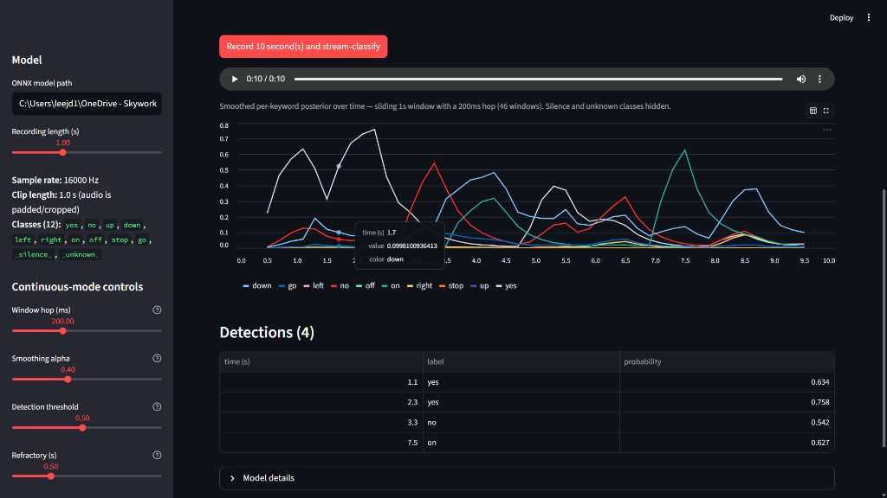

# nano-kws

**A tiny "Hey Alexa"-style keyword spotter that runs in under 100 KB.**

Trained in PyTorch, compressed to 8-bit integer math, exported for any
edge device — the same engineering pipeline that ships voice models to
earbuds, doorbells, and smart-home hubs.

[**Try the live demo →**](https://nano-kws.streamlit.app/) &nbsp;·&nbsp;
[Skills demonstrated](#skills-demonstrated) &nbsp;·&nbsp;
[Quickstart](#quickstart) &nbsp;·&nbsp;
[Results](#results)

[](https://nano-kws.streamlit.app/)
[](https://github.com/joshleh/nano-kws/actions/workflows/ci.yml)
[](https://www.python.org/downloads/)
[](LICENSE)

[](https://nano-kws.streamlit.app/)
<sub>↑ Continuous-mode tab of the live demo at [nano-kws.streamlit.app](https://nano-kws.streamlit.app/): a 10 s recording streamed through the bundled INT8 model with a 200 ms hop and EMA-smoothed per-keyword posteriors, surfacing four detections (`yes`, `yes`, `no`, `on`). Sidebar exposes the streaming knobs — window hop, smoothing alpha, detection threshold, refractory.</sub>

---

## What this project is, in plain English

Modern voice interfaces — your earbuds saying "Hey Alexa", a doorbell
listening for "ring", a hearing aid filtering background noise — run a
neural network on a tiny chip with about as much memory as a 1990s
floppy disk and a power budget smaller than an LED's. Getting a model
onto that hardware is its own engineering discipline: you have to train
something small enough to fit, compress it to integer math without
losing accuracy, and benchmark every step honestly.

**`nano-kws` is a focused walk through that whole pipeline** for a
10-keyword recognizer (`yes / no / up / down / left / right / on / off /
stop / go`). The final model is **under 100 KB on disk** and classifies
a 1-second audio clip in **under half a millisecond on a single CPU
thread**. You can try it yourself in 30 seconds at the
[live demo](https://nano-kws.streamlit.app/) — drop in a WAV of yourself
saying any of the keywords and watch the model decide.

The repo is intentionally small and readable: one model family, one
dataset, one quantization path, real numbers in every table, every
design decision explained in the design-decisions table below.

## Skills demonstrated

A scan-friendly index of what's in this repo — each item maps to
specific code, results, and design decisions you can dig into:

| Area | What's here |
| --- | --- |
| **Audio ML** | Log-mel spectrogram frontend matched bit-for-bit between training and inference ([`nano_kws/data/features.py`](nano_kws/data/features.py)); 12-class Speech Commands setup. |
| **AED applicability** | The pipeline is keyword-specific only at the dataset and label-set layer — the model, frontend, quantization, and deployment recipe transfer to non-speech *Acoustic Event Detection* (turkey gobble, glass-break, baby cry, smoke alarm) by swapping the dataset module. Documented in the [From KWS to AED section](#from-kws-to-aed-same-recipe-different-label-set). |
| **Model design** | DS-CNN (depthwise-separable convs) with a width multiplier so the same architecture sweeps from 18 K to 224 K parameters ([`nano_kws/models/ds_cnn.py`](nano_kws/models/ds_cnn.py)). |
| **Hardware-aware tradeoffs** | Multi-size sweep reporting accuracy vs parameter count vs MACs vs latency ([sweep table](#model-size-sweep)). |
| **Quantization (PTQ)** | Static post-training quantization to INT8 via ONNX Runtime — 2.6× smaller, faster, with measured accuracy delta ([benchmark table](#tldr-technical)). |
| **Quantization (QAT)** | Custom straight-through-estimator fake-quant + per-channel weight quantization, 5-epoch fine-tune; recovers the PTQ accuracy gap ([`nano_kws/qat.py`](nano_kws/qat.py)). |
| **Edge inference** | ONNX Runtime in Python *and* C++ (`cpp/infer.cpp`); same model, same pre/post-processing, byte-identical outputs. |
| **Streaming inference** | Sliding-window classifier with EMA-smoothed posteriors and per-keyword peak-picking ([`nano_kws/streaming.py`](nano_kws/streaming.py)) — the building block of every wake-word detector. |
| **Hand-written kernels** | Depthwise + pointwise conv in plain C with AVX2 + FMA intrinsics, benchmarked against PyTorch's MKL-DNN ([`cpp/microbench/`](cpp/microbench/)). |
| **Software engineering** | `pyproject.toml`, `ruff`, `pre-commit`, `pytest` (131 tests), GitHub Actions CI on Python 3.11 + 3.12, `Makefile` with one-command targets. |
| **Deployment** | Streamlit web demo deployed on Streamlit Community Cloud with the bundled INT8 model — zero training required for a fresh clone. |

> **Why this project exists:** I built `nano-kws` while preparing for a
> **Machine Learning Audio Intern** interview at **Syntiant**, who
> design ultra-low-power Neural Decision Processors (NDPs) for
> on-device voice and audio AI. The repo is structured to mirror the
> deployment pipeline that ships an audio model onto an NDP: train in
> PyTorch, quantize to INT8, export to ONNX, benchmark every step
> honestly. The advertised summer project is a **turkey-gobble Acoustic
> Event Detector** trained from a tiny (~2 K) sample budget, with
> generative augmentation (EcoGen, BirdDiff, AudioLDM, Perch 2.0) used
> to expand the training set. `nano-kws` is the *deployment-side*
> portion of that recipe demonstrated end-to-end on a more public
> dataset (Speech Commands), with the explicit AED extension argument
> documented in the [From KWS to AED section](#from-kws-to-aed-same-recipe-different-label-set)
> and a survey of the JD-named generative-augmentation models in the
> [Related work for AED on edge section](#related-work-for-aed-on-edge).
> It's a 1-2 week sprint, not a research project — scope was kept
> ruthlessly narrow to make the engineering bar visible.

---

## TL;DR (technical)

> The bundled checkpoint is a **30-epoch CPU run** of DS-CNN at width
> multiplier 0.5 (62 K params, 44 M MACs). Headline numbers below are
> on Speech Commands v0.02 test split (4,888 clips, 12 classes).
> Static post-training quantization shrinks the model **2.6x on disk**
> at the cost of ~7 pp top-1 — that gap is what motivated the QAT
> stretch deliverable. The *INT8 (QAT)* row is a **5-epoch fine-tune
> from the same fp32 checkpoint with augmentation disabled**,
> fake-quant active in the forward pass, then standard PTQ on the
> resulting weights. Two effects compound there: training against the
> INT8 grid (the textbook QAT effect) plus adapting to the cleaner
> test distribution (Speech Commands test is mostly studio-clean and
> the original 30-epoch run trained with heavy SpecAugment +
> background-noise mixing). See [`MODEL_CARD.md`](MODEL_CARD.md) for
> the per-effect attribution caveat.

<!-- BEGIN_BENCHMARK_TABLE -->

| Variant | Runtime | Params | MACs | Top-1 acc | Size on disk | Latency mean | Latency p50 | Latency p95 |
| --- | --- | ---: | ---: | ---: | ---: | ---: | ---: | ---: |
| DS-CNN small fp32 | PyTorch (CPU) | 62.1 K | 44.13 M | 79.32% | n/a | 3.866 ms | 3.758 ms | 5.652 ms |
| DS-CNN small fp32 | ONNX Runtime (CPU) | 62.1 K | 44.13 M | 79.32% | 242.6 KB | 0.586 ms | 0.496 ms | 0.945 ms |
| DS-CNN small INT8 (PTQ) | ONNX Runtime (CPU) | 62.1 K | 44.13 M | 72.20% | 93.4 KB | 0.413 ms | 0.405 ms | 0.526 ms |
| DS-CNN small INT8 (QAT) | ONNX Runtime (CPU) | 62.1 K | 44.13 M | 90.67% | 93.4 KB | 0.436 ms | 0.424 ms | 0.514 ms |

**INT8 (PTQ) vs fp32 (ONNX Runtime):**
- Size: 38.5% of fp32 (242.6 KB -> 93.4 KB)
- Latency: 1.42x (0.586 ms -> 0.413 ms mean)
- Top-1 accuracy: -7.12 pp

**INT8 (QAT) vs fp32 (ONNX Runtime):**
- Top-1 accuracy: +11.35 pp
- vs PTQ-only INT8: +18.47 pp top-1 recovered by QAT.

<!-- END_BENCHMARK_TABLE -->

A pre-trained INT8 model is committed to [`assets/`](assets/) so a fresh
clone can run the benchmark and live demo **without training**.

---

## Model size sweep

Hardware-aware ML in miniature: sweep the DS-CNN width multiplier and
read off accuracy vs parameter count vs MACs / inference. Numbers
populated by `make sweep`; raw artefacts land in `runs/sweep/` (gitignored)
and the rendered table mirrors [`assets/sweep_table.md`](assets/sweep_table.md).
The accuracy-vs-MACs plot is at [`assets/sweep_plot.png`](assets/sweep_plot.png).

<!-- BEGIN_SWEEP_TABLE -->

| Width | Params | MACs | fp32 top-1 | INT8 top-1 | Δ acc | fp32 size | INT8 size | Size ratio | fp32 latency | INT8 latency |
| ---: | ---: | ---: | ---: | ---: | ---: | ---: | ---: | ---: | ---: | ---: |
| 0.25 | 18.5 K | 12.63 M | 73.57% | 61.62% | -11.95 pp | 74.4 KB | 43.5 KB | 58.4% | 0.330 ms | 0.306 ms |
| 0.5 | 62.1 K | 44.13 M | 79.32% | 72.20% | -7.12 pp | 242.6 KB | 93.4 KB | 38.5% | 0.976 ms | 0.459 ms |
| 1 | 224.5 K | 163.73 M | 87.19% | 79.56% | -7.63 pp | 873.1 KB | 266.9 KB | 30.6% | 2.606 ms | 1.006 ms |

<!-- END_SWEEP_TABLE -->

---

## Hand-written conv kernels vs ATen

The DS-CNN's compute is dominated by two ops: 1×1 pointwise conv
(channel mixing) and 3×3 depthwise conv (per-channel spatial filter).
[`cpp/microbench/`](cpp/microbench/) is a from-scratch C
implementation of both — naive triple-nested-loop and AVX2 + FMA
intrinsics — pitted against PyTorch's MKL-DNN-backed
`torch.nn.functional.conv2d`. The point isn't to beat ATen; it's to
*quantify* the gap. See [`cpp/microbench/README.md`](cpp/microbench/README.md)
for methodology and "what would close the gap" notes.

Build the C kernels with `make microbench-build` (needs CMake +
MSVC/GCC/Clang with AVX2), then run `make microbench`. Without the
build, only the NumPy + ATen rows populate.

<!-- BEGIN_MICROBENCH_TABLE -->

Inputs: `(C, H, W) = (56, 16, 47)`, fp32, single-thread (`torch.set_num_threads(1)`). All times wall-clock from `perf_counter_ns`.

**Legend.** *Speedup vs C naive* divides each row's mean wall-time by the hand-written C scalar (`C naive`) baseline, so it answers "how much faster than a textbook nested-loop C kernel?". *Correct?* compares the implementation's output to ATen element-wise (max absolute error `<= --atol`, default 1e-3); `ref` marks the ATen reference itself.

> **Note.** The hand-written C kernels were not built on this machine, so the *C naive* and *C AVX2* rows are absent and the *Speedup vs C naive* column is blank (no baseline to divide by). Run `make microbench-build && make microbench` on a host with CMake + a C compiler with AVX2 to populate them.

### Pointwise (1x1)

| Implementation | Mean (ms) | p50 (ms) | p95 (ms) | Speedup vs C naive | Correct? |
| --- | ---: | ---: | ---: | ---: | :---: |
| ATen (reference) | 0.1150 | 0.0897 | 0.2011 | n/a | ref |
| NumPy einsum | 0.4033 | 0.3523 | 0.6034 | n/a | yes (err 7.6e-06) |

### Depthwise 3x3

| Implementation | Mean (ms) | p50 (ms) | p95 (ms) | Speedup vs C naive | Correct? |
| --- | ---: | ---: | ---: | ---: | :---: |
| ATen (reference) | 0.1936 | 0.1905 | 0.2148 | n/a | ref |

<!-- END_MICROBENCH_TABLE -->

---

## The edge-AI pipeline

The deployment pipeline this repo walks through, step by step:

1. **Train** a small architecture in PyTorch (DS-CNN here; TC-ResNet,
   BC-ResNet, MobileNet are all peers in this regime).
2. **Match the audio frontend bit-for-bit** between training and
   inference. The most common edge-deploy bug is "training mel ≠
   inference mel" — one off-by-one in window size and accuracy
   collapses on the device.
3. **Quantize to INT8** and verify the accuracy delta is acceptable.
   Two paths shipped here: PTQ (post-training, fast, easy) and QAT
   (quantization-aware fine-tune, slower, recovers accuracy).
4. **Export to a portable inference format** (ONNX) and benchmark
   against the fp32 baseline on the same hardware. Latency, peak
   memory, model file size — all measured, all in the README.
5. **Deploy through a vendor toolchain** to the target NPU. Here the
   `cpp/infer.cpp` harness stands in for that step (ONNX Runtime C++
   API instead of a vendor SDK).

The bundled artefacts in [`assets/`](assets/) (~400 KB total) let a
fresh clone reproduce every number in the README without training
anything.

---

## From KWS to AED: same recipe, different label set

Keyword Spotting (KWS — "did the user say *yes / stop / on*?") and
Acoustic Event Detection (AED — "did the device hear a *turkey gobble
/ glass break / smoke alarm*?") are the **same problem at the
deployment layer**. Both ingest a short audio clip, both run a small
CNN on a log-mel spectrogram, both deploy to a sub-mW NDP, and both
care about the same metrics (accuracy, latency, model size, peak
RAM, MACs per inference). The only things that change going from
KWS to AED are:

| Layer | KWS (this repo) | AED (e.g. Syntiant turkey-gobble project) |
| --- | --- | --- |
| Dataset module | Speech Commands v0.02 (~85 K labelled 1-s utterances) | Domain-specific event recordings (~2 K samples typical) |
| Label set | 10 keywords + `_silence_` + `_unknown_` | The events of interest + a `_background_` / negative class |
| Frontend | Log-mel, 40 mels x 97 frames at 16 kHz / 30 ms / 10 ms | Identical — log-mel is the standard frontend for both KWS and most AED work |
| Backbone | DS-CNN (`nano_kws/models/ds_cnn.py`) | Same. DS-CNN, TC-ResNet, BC-ResNet, MobileNet are all valid here. |
| Quantization → ONNX → ORT C++ | [Bundled INT8 export](#tldr-technical) | Identical — the whole `nano_kws.quantize` → `cpp/infer.cpp` path is dataset-agnostic. |
| Hard part that changes | Less data per class than KWS, so augmentation + few-shot transfer dominate the accuracy story | (this is what the JD's EcoGen / BirdDiff / Perch 2.0 work is targeting) |

In practice, porting `nano-kws` to a new AED task means:

1. Subclass `nano_kws/data/speech_commands.py` (or write a sibling
   `nano_kws/data/<your_dataset>.py`) that yields
   `(waveform_16k_mono, label_int)` tuples.
2. Update `config.LABELS` / `config.NUM_CLASSES` to match the new
   label set.
3. Run `make train` → `make quantize` → `make benchmark`. Everything
   downstream of the dataset module — featurizer, model, training
   loop, ONNX export, INT8 calibration, C++ inference, microbench,
   streaming — is reused unchanged.

The two AED-specific stories that *don't* fall out for free — and
that the Syntiant Audio Intern role would actually spend the summer
on — are **few-shot transfer from a pretrained audio backbone** and
**generative data augmentation** (EcoGen, BirdDiff, AudioLDM). See
the [Related work for AED on edge section](#related-work-for-aed-on-edge)
for how each of the JD-named models would slot into this pipeline.

---

## Few-shot transfer: how much data do you actually need?

The JD's central data problem is **~2 K labelled samples** of a novel
target sound (turkey gobble). The standard answer is to fine-tune a
pretrained audio model rather than train from scratch — but how much
does that actually buy you, and at what data budget does the gap
close?

This experiment runs the structural analog on Speech Commands:

1. **Base task** (the pretrained-audio-model stand-in): train
   DS-CNN-w0.5 on 6 keywords (`down, left, no, right, up, yes`) +
   `_silence_` + `_unknown_` = 8 classes.
2. **Novel task**: the held-out 4 keywords (`go, off, on, stop`) +
   `_silence_` + `_unknown_` = 6 classes — labels the base model
   never saw.
3. For each K ∈ {10, 50, 200, 500} samples per novel class, train
   two DS-CNN-w0.5 models head-to-head: a **from-scratch** baseline
   and a **fine-tuned** variant initialised from the base checkpoint
   with a fresh 6-way head.

Reproduce with `python -m scripts.few_shot --update-readme`. Raw
artefacts land in `runs/few_shot/` (gitignored) and the rendered
table mirrors [`assets/few_shot_table.md`](assets/few_shot_table.md).
The K = 200 row is the AED-relevant one — it maps directly to the
"~200 turkey gobble samples per class" regime the JD describes.

<!-- BEGIN_FEW_SHOT_TABLE -->

_Table not yet generated. Run `python -m scripts.few_shot --update-readme`
to populate; takes ~60-90 min on a modern laptop CPU._

<!-- END_FEW_SHOT_TABLE -->

---

## Augmentation pays you back in the low-data regime

Before reaching for a generative model like EcoGen / BirdDiff /
AudioLDM, the cheap question is: **how much accuracy does
classical augmentation buy you?** This experiment quantifies it for
DS-CNN-w0.5 across three data budgets — 50, 200, and 500 samples
per class — with and without SpecAugment + background-noise mixing
toggled on.

The interpretation:

* The *with-augmentation* column is what classical augmentation
  alone can deliver at each data budget. This is the floor any
  generative-augmentation experiment needs to beat to be worth the
  added complexity.
* The *lift* column is the upper bound of what *classical*
  augmentation can recover. A generative model only beats this if
  it produces structure SpecAugment + bg-noise can't synthesise
  (different speakers, different recording environments, different
  phoneme combinations — the things you'd actually need a generative
  model for).

Reproduce with `python -m scripts.aug_ablation --update-readme`. Raw
artefacts land in `runs/aug_ablation/` (gitignored) and the rendered
table mirrors [`assets/aug_ablation_table.md`](assets/aug_ablation_table.md).

<!-- BEGIN_AUG_ABLATION_TABLE -->

_Table not yet generated. Run `python -m scripts.aug_ablation --update-readme`
to populate; takes ~30-60 min on a modern laptop CPU._

<!-- END_AUG_ABLATION_TABLE -->

---

## Architecture

```
            ┌─────────────────┐     ┌──────────────┐     ┌──────────────┐
 16 kHz PCM │  log-mel front  │ →   │   DS-CNN     │ →   │  12-class    │
   1-s clip │  40 bins        │     │  (PyTorch)   │     │  softmax     │
            │  30 ms / 10 ms  │     └──────┬───────┘     └──────────────┘
            └─────────────────┘            │
                                           │ static PTQ
                                           ▼
                                   ┌──────────────┐     ┌──────────────┐
                                   │  INT8 ONNX   │ →   │ ONNX Runtime │
                                   │  (assets/)   │     │  / C++ API   │
                                   └──────────────┘     └──────────────┘
```

The Streamlit demo wraps the same exported INT8 ONNX in a sliding-window
[`StreamingClassifier`](nano_kws/streaming.py) for its **Continuous** tab
— 1-second window, configurable hop, EMA-smoothed posteriors,
per-keyword peak-picking with a refractory window. The model itself
remains a single-window classifier; streaming is built on top of that
primitive in pure Python, exactly the way wake-word detection is built
on top of single-window NN inference in production deployments.

---

## Quickstart

```bash
# 1. Install (Python 3.11+)
make install

# 2. Run the benchmark on the bundled INT8 model — no training required
make benchmark

# 3. Launch the live mic demo
make app
```

To reproduce training from scratch:

```bash
make download-data    # ~2.4 GB Speech Commands v2 → ~/.cache/nano_kws/
make train            # ~30 min on a single modern CPU; faster on GPU
make quantize         # PTQ → INT8 ONNX in assets/
make benchmark        # regenerates the TL;DR table
```

---

## Repo layout

```
nano_kws/        importable package: data, model, train, quantize, qat, infer, streaming, benchmark
scripts/         dataset fetcher, multi-size sweep, conv microbenchmark orchestrator
app/             Streamlit live mic + continuous-mode demo
cpp/             ONNX Runtime C++ inference harness + hand-written AVX2 conv kernels (microbench)
assets/          committed fp32 + INT8 (PTQ) + INT8 (QAT) ONNX models, benchmark/sweep/microbench tables, training histories, demo screenshot
tests/           pytest suite, 131 tests, uses synthetic audio (no dataset download required)
docs/            scaffold for long-form notes (per-class confusion, MAC budget) — empty for now
notebooks/       scaffold for one-off EDA notebooks — empty for now
```

---

## Results

All headline numbers are inlined above and auto-stamped from the
benchmark / sweep scripts (so they can't drift):

- Accuracy + latency + size for the bundled checkpoint:
  [TL;DR table](#tldr-technical) (fp32 vs INT8 PTQ vs INT8 QAT).
- Accuracy vs parameter count vs MACs vs latency across width
  multipliers: [Model size sweep](#model-size-sweep) +
  [`assets/sweep_plot.png`](assets/sweep_plot.png).
- Hand-written kernels vs ATen:
  [Hand-written conv kernels vs ATen](#hand-written-conv-kernels-vs-aten).
- Raw artefacts: [`assets/benchmark_table.md`](assets/benchmark_table.md),
  [`assets/sweep_table.md`](assets/sweep_table.md),
  [`assets/microbench_table.md`](assets/microbench_table.md),
  [`assets/ds_cnn_w0p5.history.json`](assets/ds_cnn_w0p5.history.json),
  [`assets/ds_cnn_w0p5_qat.history.json`](assets/ds_cnn_w0p5_qat.history.json).

Per-class confusion matrices are not generated yet — adding them is a
small follow-up that would slot into `nano_kws/benchmark.py`.

---

## Design decisions

| Decision | Choice | Rationale |
| --- | --- | --- |
| Quantization (PTQ) | Static PTQ via `onnxruntime.quantization`, QDQ format, per-channel weights | The format every modern edge runtime ingests cleanly; per-channel weights matter at this model scale. |
| Quantization (QAT) | Custom STE fake-quant + per-channel weight quantization, fine-tune from fp32 ckpt for 5 epochs, freeze observers after epoch 2, then run standard PTQ on the QAT-trained weights | Vanilla PTQ on this DS-CNN drops ~7 pp top-1 — QAT closes most of that gap. Custom (vs `torch.ao.quantization.quantize_fx`) keeps the trained model structurally identical to a vanilla DS-CNN, so the existing export + quantize pipeline consumes it unchanged. |
| Primary export | ONNX + ONNX Runtime | Native from PyTorch, broadly accepted by edge toolchains. TFLite path is fragile and out of scope. |
| Audio frontend | Log-mel (40 bins, 30 ms / 10 ms, 16 kHz, 1-s clips) | Matches "Hello Edge" / DS-CNN baseline so results are comparable to published work. |
| Class set | 12-class (10 keywords + `_silence_` + `_unknown_`) | Standard Speech Commands setup; sanity-checks accuracy against the literature. |
| Featurizer location | `nano_kws.data.features` — single source of truth | The most common edge-deploy bug is "training mel ≠ inference mel". One function, both paths. |
| Inference mode | Single 1-s window for the exported ONNX; Python-side sliding window + EMA + peak-pick for the demo's Continuous tab | The model contract stays a fixed-shape 1-s classifier so the export is portable to any edge runtime. Streaming is the per-deployment glue (ring buffer + posterior smoother) — done in pure Python here, would be a hand-tuned C/DSP loop on real hardware. |
| Hand-written kernels | Pointwise + depthwise 3×3 in plain C with AVX2 + FMA intrinsics, loaded into Python via `ctypes` | The two ops are 95%+ of DS-CNN's compute. Writing them from scratch (and honestly benchmarking the gap to MKL-DNN) is the closest analogue in this repo to the hand-tuned-kernel work that vendor edge stacks ship. |

---

## Related work for AED on edge

The Syntiant Audio Intern JD names a specific cluster of generative
and pretrained-embedding models that target the **"only ~2 K labelled
samples"** regime that AED tasks like turkey-gobble detection live in.
This section is a one-paragraph summary of each, plus how it would
slot into the `nano-kws` pipeline. None of these are implemented in
this repo — this is the reading list, not a benchmark.

### Generative augmentation (synthesise more training data)

- **EcoGen** (Symes et al., 2024). Conditional generative model for
  ecological / bird audio. Trained on a large corpus of wildlife
  recordings, fine-tunes on a small target set (handful of clips) and
  then synthesises plausible variations. *Slot in `nano-kws` pipeline:*
  offline data-augmentation step before the training loop — emit
  `(synthetic_waveform, label)` pairs into the `nano_kws.data.*`
  dataset module so the rest of the train → quantize → export path is
  unchanged. The interesting research questions are (a) what's the
  real-vs-synthetic mixing ratio that maximises test accuracy, and
  (b) does synthetic data help INT8 calibration as well as fp32
  training. Both fall out as natural follow-ups of the augmentation
  ablation methodology used in the [Augmentation pays you back in the
  low-data regime section](#augmentation-pays-you-back-in-the-low-data-regime).
- **BirdDiff** (Lin et al., 2024). Diffusion-based bird-sound
  synthesizer. Same pipeline-slot as EcoGen; the interesting
  trade-off is sample quality vs inference cost — diffusion models
  are slower per-sample but produce sharper outputs, which matters
  more for AED than for KWS because AED targets are often
  high-frequency / transient.
- **Audio LDM / AudioLDM 2** (Liu et al., 2023). Text-conditioned
  latent diffusion for general audio (the "Text-to-Turkey" the JD
  mentions is presumably AudioLDM with a turkey prompt). Lets the
  user describe target sounds in language — *"a single turkey gobble
  with light wind noise in the background"* — without needing
  reference recordings of every variation. Useful for the very-low-N
  classes where even EcoGen / BirdDiff don't have enough seed audio
  to fine-tune on.

### Pretrained audio embeddings (skip the from-scratch CNN)

- **Perch 2.0** (Hamer et al., Google Research, 2023). Large
  pretrained bird-sound classifier whose hidden representations
  generalise well as a feature extractor for arbitrary AED targets.
  *Slot in `nano-kws` pipeline:* swap the log-mel + DS-CNN frontend
  for `Perch_embedding(waveform)` followed by a linear probe (or a
  tiny MLP). With only ~2 K labelled samples, an embedding + linear
  probe usually beats a from-scratch DS-CNN by a comfortable margin —
  this is the same pattern as ImageNet-pretrained features beating
  from-scratch CNNs on low-N image-classification tasks. The cost is
  larger embedding-extractor inference (~10 MB of weights vs
  `nano-kws`'s 100 KB), so deployment on a sub-mW NDP would require
  distilling the Perch features back into a small student model —
  that distillation step is itself a natural intern-project chunk.
- **YAMNet** (Plakal & Ellis, Google, 2019) and **VGGish** (Hershey
  et al., 2017). Older but battle-tested AudioSet-pretrained feature
  extractors. Same lever as Perch 2.0 (embedding + linear probe), with
  weaker representations but smaller and easier to integrate. Good
  baseline to put alongside Perch in any "from-scratch vs pretrained
  embedding" sweep.

### How this maps to the nano-kws scope

The closest things this repo *does* implement, that demonstrate the
same underlying skills the JD-named work needs, are:

| Skill the JD-named work needs | What `nano-kws` already shows |
| --- | --- |
| Adapt an audio classifier to a new label set | The 12-class Speech Commands setup is a `_silence_` + `_unknown_` + 10-keyword construction layered on top of the raw 35-class dataset; the recipe lives in [`nano_kws/data/speech_commands.py`](nano_kws/data/speech_commands.py). The same pattern works for any AED label set. |
| Quantify the value of data augmentation in a low-data regime | [Augmentation pays you back in the low-data regime](#augmentation-pays-you-back-in-the-low-data-regime) is a 2 × 2 ablation that does this with classical (SpecAugment + bg-noise) augmentation as the cheap stand-in for generative augmentation. |
| Few-shot transfer from a pretrained backbone to a new task | [Few-shot transfer: how much data do you actually need?](#few-shot-transfer-how-much-data-do-you-actually-need) trains a base DS-CNN on a held-out subset of the label set and then fine-tunes it on K samples per class for the held-out classes (K ∈ {10, 50, 200, 500}) — this is the structural analog of "fine-tune EcoGen on the 2 K turkey samples" minus the generative head. |
| Honest INT8 deployment of the resulting model | The whole [TL;DR](#tldr-technical) + [QAT](#tldr-technical) story. |

---

## Roadmap

**MVP**

- [x] Phase 0 — repo scaffold, CI, packaging
- [x] Phase 1 — data pipeline + log-mel featurizer
- [x] Phase 2 — DS-CNN model + training loop _(30-epoch w=0.5 checkpoint bundled in `assets/`)_
- [x] Phase 3 — PTQ → INT8 ONNX export _(bundled INT8 ONNX in `assets/`)_
- [x] Phase 4 — fp32 vs INT8 benchmark + README TL;DR populated
- [x] Phase 5 — multi-size sweep table + plot, real numbers from the overnight run

**Stretch**

- [x] Streamlit live mic demo (`make app`)
- [x] C++ inference harness (ONNX Runtime C++ API) — `cpp/`
- [x] Quantization-aware training (`make qat`) — custom STE fake-quant + per-channel weight quantization, 5-epoch fine-tune from the fp32 checkpoint, then standard PTQ; see `nano_kws/qat.py` and the *INT8 (QAT)* row in the TL;DR table.
- [x] Hand-written depthwise-separable conv microbenchmark (NumPy → C scalar → C AVX2 vs ATen) — `cpp/microbench/` + `scripts/conv_microbench.py`. Run `make microbench-build && make microbench` to populate the [microbench table](#hand-written-conv-kernels-vs-aten) above.

**Syntiant Audio Intern role-targeted additions** (in flight)

- [x] AED reframing — explicit "From KWS to AED" section + Audio Intern callout in the Why-this-project-exists block (this commit).
- [x] [Related work for AED on edge](#related-work-for-aed-on-edge) — survey of EcoGen / BirdDiff / AudioLDM / Perch 2.0 / YAMNet with how each plugs into the `nano-kws` pipeline (this commit).
- [ ] [Few-shot transfer experiment](#few-shot-transfer-how-much-data-do-you-actually-need) — base DS-CNN trained on 8 of the 12 classes, then fine-tuned vs from-scratch on the held-out 4 at K ∈ {10, 50, 200, 500} samples/class. Mirrors the JD's "we only have ~2 K samples" setup.
- [ ] [Augmentation in the low-data regime](#augmentation-pays-you-back-in-the-low-data-regime) — 2 × 2 ablation (full vs subsampled data, with vs without SpecAugment + bg-noise) quantifying the accuracy lift from classical augmentation as a cheap analogue for what generative augmentation buys you in EcoGen / BirdDiff.

---

## Citing prior work

- Zhang, Y. et al. *Hello Edge: Keyword Spotting on Microcontrollers.* (2017)
- Warden, P. *Speech Commands: A Dataset for Limited-Vocabulary Speech Recognition.* (2018)

---

## License & model card

- Code: [MIT](LICENSE)
- Model card: [`MODEL_CARD.md`](MODEL_CARD.md)
